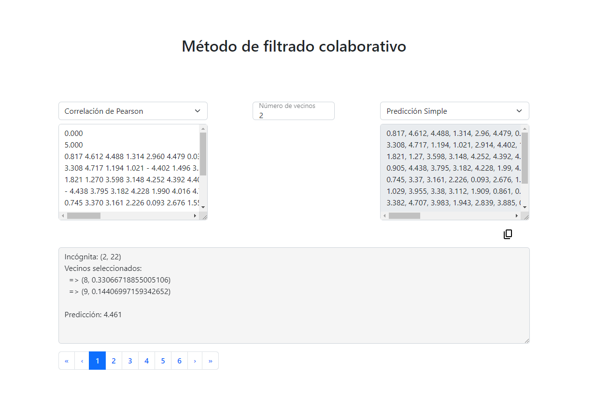

# Sistemas de recomendación. Métodos de filtrado colaborativo
## Descripción del proyecto

- El objetivo de este proyecto es implementar un sistema de recomendación siguiendo el método de filtrado colaborativo.
- Se ha desarrollado en el lenguaje de programación Typescript.
- La aplicación se ha desarrollado para mostrarla en una interfaz web.

## Pasos previos para la ejecución del proyecto

  1. Debe instalar *Node.js* en su equipo:
  ```
  sudo apt install nodejs
  ```
  2. Debe instalar *pnpm* en su equipo:
  ```
  pnpm install
  ```
  3. En el caso de que tenga problemas al instalar *pnpm* puede ejecutar el siguiente comando para actualizar la máquina:
  ```
  sudo apt update
  sudo apt upgrade
  ```
  4. Ahora debe clonar el repositorio:
  ```
  git clone git@github.com:Kevinss02/FiltradoColaborativo.git
  ```
## Ejecución

  - Para ejecutar el proyecto debe situarse en la carpeta *FiltradoColaborativo* y ejecutar el siguiente comando:
  ```
  npm run dev
  ```
  - Ahora debe abrir su navegador y acceder a la siguiente dirección:
  ```
  http://localhost:5173/
  ```
  - En esa dirección se mostrará la interfaz web para poder ejecutar el proyecto, donde deberá introducir la matriz de datos, seleccionar la métrica, el número de vecinos y el tipo de predicción.
## Implementación del código

Para el desarrollo de este código cabe a destacar una serie de pasos que hemos seguido para su implementación:
  - Se ha realizado un fichero(`similaryFunctions.ts`) que contiene las funciones a calcular la *correlación de Pearson, la distancia coseno y la distancia Euclídea*, así como `predictionFunctions.ts` contiene las funciones para calcular las predicciones.
  ---
  - El fichero `readMatrix.ts` se encarga de recibir los datos de entrada y de transformarlos en una matriz. Las dos primeras filas consisten en el rango de valores que puede contener la matriz. En el caso de que se superen estos valores, la matriz no sería válida. El resto de filas se corresponden con los usuarios y las columnas con los items. Los valores de la matriz son las puntuaciones que ha dado cada usuario a cada item.
  ---
  - Además, `readMatrix.ts` se encarga de contar el número de incóginitas que hay en cada fila. Para una mejor evaluación de los resultados, se evaluarán primero los usuarios que tengan menos incógnitas, para que así los nuevos datos obtenidos sean de mayor utilidad para las siguientes predicciones. La cola `queue` almacena en orden las filas con menos incógnitas y guardando la posición de las columnas donde se encuentran. Funciona como un *FIFO*.
  ---
  - En el fichero `calculate.ts` se desarrolla el cálculo y la implementación de las predicciones. Este fichero funciona de la siguiente manera:
    1. Se realiza un bucle en base a la cola `queue`, donde se va a evaluar el primer usuario dentro de la cola.
    2. Ahora dentro de ese usuario se identifica la primera incógnita que se encuentra en la fila. Se almacena la posición de la columna donde se encuentra.
    3. Dependiendo de la métrica seleccionada en la interfaz web(*Pearson, coseno o Euclídea*) se calcula la similitud entre el usuario actual y el resto de usuarios. Se almacena en un array `metricVector` la similitud de cada usuario con el usuario actual y se ordena de mayor a menor en el caso de *Pearson* y de menor a mayor en el caso de *coseno y Euclídea*. Este vector ordenado servirá para seleccionar los vecinos. Cabe destacar que si un vecino cercano no ha valorado el item, no se tendrá en cuenta para la predicción.
    4. A través de los vecinos seleccionados se calcula la predicción para la incógnita actual. Se realizará el tipo de predicción seleccionado dentro de la interfaz web y se calculará el valor de la predicción para esa incógnita.
    5. Este valor se sustituirá por la posición con incógnita correspondiente dentro de la matriz. Este nuevo valor se utilizará para las siguientes predicciones.
    6. Se vuelve a repetir el proceso hasta que se hayan evaluado todas las incógnitas dentro de la matriz, mostrando por la web la matriz resultante a través de la métrica seleccionada, el número de vecinos y el tipo de predicción.
    7. La interfaz web muestra diferentes cosas: el cuadro de introducción de la matriz, la selección de la métrica, la selección por teclado del número de vecinos, la selección de la predicción a través de un desplegable, la matriz resultante y un último cuadro donde se muestra en el orden en el que se han calculado cada una de las incógnitas. Incluye una navegación.

## Ejemplo de uso

  En el caso mostrado dentro de la web, se ha utilizado la matriz de datos `utility-matrix-10-25-1.txt` del [repositorio](https://github.com/ull-cs/gestion-conocimiento/blob/main/recommeder-systems/examples-utility-matrices/):
  
